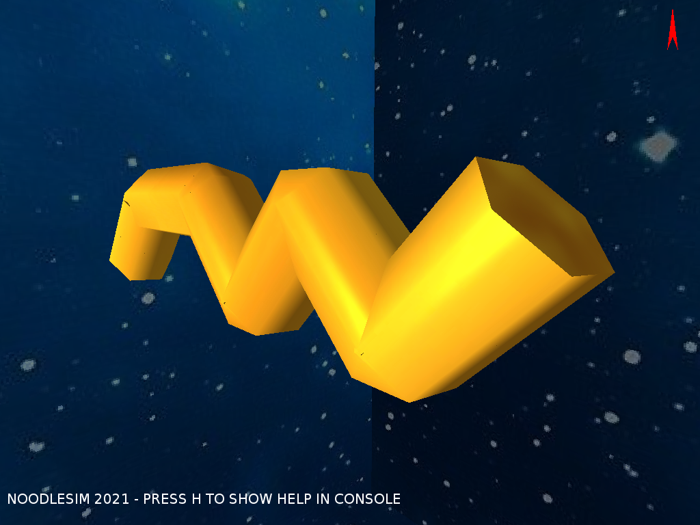

# Noodle Simulator 2021

50.017 Graphics and Visualisation Final Project




An extremely cursed noodle simulator written in LWJGL (wrapped over OpenGL), with questionable physics simulation of internal elastic forces. Due to my inability to grasp the concept of physics simulation properly, it looks more like a worm struggling to swim in a vacuum without any external forces, hence the space background.

This project is started off from [Chapter 13](https://lwjglgamedev.gitbooks.io/3d-game-development-with-lwjgl/content/chapter13/chapter13.html) of the online book [3D Game Development with LWJGL 3](https://lwjglgamedev.gitbooks.io/3d-game-development-with-lwjgl/content/), with several modifications:

- Extracted methods of GameItem and Mesh into interfaces
- Don't unload textures when the Mesh is destroyed (reusing texture)
- Screenshot functionality
- Set the scene's mesh map to be static and public (oof) to be able to monkey-patch arbitary meshes not bound to a GameItem (specifically the cross sections)
- Distributed in Uber-Jars that will automatically extract textures into the current working directory (sorry)

# How to run

**Requires Java 15 and above**

Download the uber jar (platform specific) from the releases page, and run from the terminal with `java -jar path-to-jar.jar`

To build this project from source, clone the project and setup as a maven project (or just use IntelliJ).

# Usage

```
WASD LSHIFT SPACE - camera movement
RIGHTMOUSE+DRAG - camera look
T - change texture
L - toggle swept surface visibility
C - change cross section shape
UP/DOWN - increment/decrement number of sides in cross section
RIGHT - step forward physics simulation
R - take screenshot
P - print camera position
```

# Code explanation

Let's start with the noodle geometry, in the `moe.chesnot.noodle.geometry` package.

The `Noodle` is the main class that creates the swept surface mesh and the cross sectional areas (CSA) meshes. To do so, it first requests a `NoodleCurveFactory` that produces `NoodleCurves`. Based on the reported capabilities of the factory such as the subset size, it splits the physical points (defaults set in the constructor) into subsets of points. A `NoodleCurve` represents a parametric curve that (should) fit through the points.

After the curve segments have been created, each curve is stepped through from 0 to 1 to produce more interpolated points, as well as a tangent. A CSA polygon mesh is created at each interpolated point, normal facing its respective tangent. This CSA is highly configurable, such as the shape, number of points and radius.

After all the CSA has been created, the swept **surface** (not volume) mesh is created by creating triangles inbetween all the points of the CSA polygons. The exact algorithm can be found in the code, but it is quite obvious when you hold up two polygons in real life and try to connect triangles to form a closed surface.

Now for the physics in the `moe.chesnot.noodle.physics` package.

The `Noodle` also creates many `PointMass` instances. Each PointMass keeps track of `ForceComponent` instances that is being applied to it, as well as the current position, velocity and acceleration. At every time step of the physics simulation, all the `ForceComponent` instances are summed up and integrated over a small time step (dt) to get dA, which is integrated again to get dV, which is integrated again to get dX.

Currently the only force present is `DampedSpringForceComponent`, representing a damped spring. It applies a restoring force when expanded/compressed, as well as a damping force that varies based on the mass's current velocity. Main springs are created by simply connecting consecutive points with each other. Support springs are approximated by connecting (i, i+2) points for each point i. Note that to adhere by Newton's third law, when a `PointMass` registeres a `DampedSpringForceComponent` with another `PointMass` as the parent (the "anchor") of the spring, another `DampedSpringForceComponent` needs to be created with the parent-child relationship reversed.